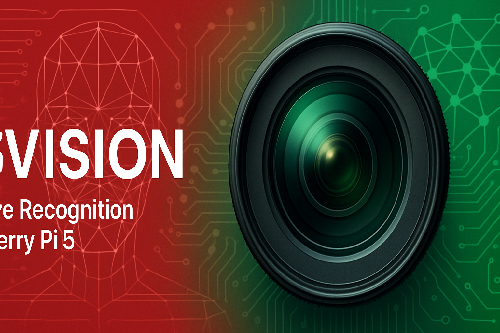
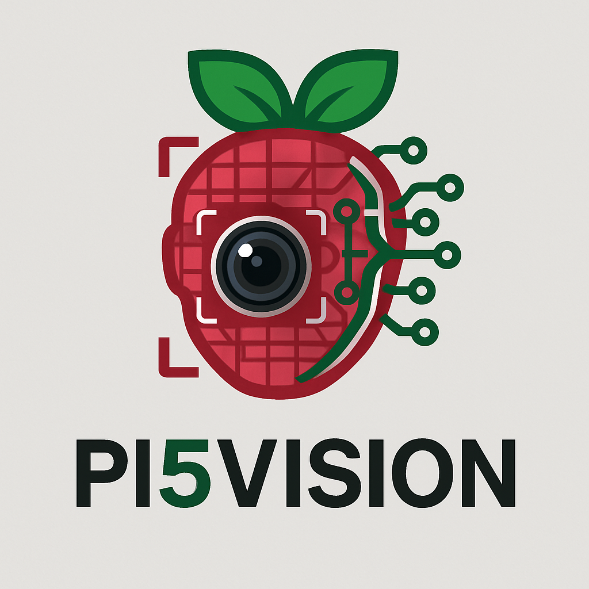

<div align="center">



# Pi5Vision

**Advanced Face Recognition System for Raspberry Pi 5**

[](https://github.com/ereezyy)
[](https://python.org)
[](https://www.raspberrypi.org/)
[](https://hailo.ai/)
[](LICENSE)

*Pi5Vision is a state-of-the-art face recognition system designed specifically for the Raspberry Pi 5 with Hailo AI HAT+. Leveraging the powerful 26 TOPS AI accelerator, Pi5Vision delivers enterprise-grade face detection, recognition, and analysis with exceptional performance and accuracy.*

</div>

## Key Features

- **Real-time Face Detection & Recognition**: Lightning-fast processing with 97.2% detection accuracy
- **Immersive Web Dashboard**: Modern, responsive interface accessible from any device
- **Advanced Analytics**: Comprehensive visitor statistics and trends
- **Smart Notifications**: Customizable alerts across multiple channels
- **Enhanced Security**: Enterprise-grade encryption and privacy controls
- **Smart Home Integration**: Seamless connection with popular home automation platforms
- **Optimized Performance**: Adaptive processing for maximum efficiency

## Hardware Requirements

- **Raspberry Pi**: Raspberry Pi 5 (4GB RAM minimum, 8GB recommended)
- **AI Accelerator**: Hailo-8 AI HAT+ (26 TOPS)
- **Camera**: USB Camera (1080p recommended)
- **Storage**: 32GB+ microSD card (Class 10 or better)
- **Power Supply**: 5V/3A USB-C power supply

## Quick Start

1. Clone this repository:
   ```bash
   git clone https://github.com/yourusername/pi5vision.git
   cd pi5vision
   ```

2. Run the installation script:
   ```bash
   chmod +x install.sh
   ./install.sh
   ```

3. Access the web dashboard:
   ```
   http://your-pi-ip-address:8080
   ```

## Documentation

- [User Manual](user_manual.md) - Complete guide to using Pi5Vision
- [Showcase Guide](showcase_guide.md) - Detailed overview of all features
- [Validation Report](enhanced_validation_report.md) - Performance and accuracy metrics

## System Architecture

Pi5Vision employs a modular architecture with these key components:

- **Core Engine**: Multi-model ensemble for detection and recognition
- **Web Dashboard**: Vue.js frontend with FastAPI backend
- **Database**: TimescaleDB for efficient time-series data
- **Notification System**: Multi-channel alert distribution
- **Optimization Layer**: Adaptive processing based on system conditions

## License

This project is licensed under the MIT License - see the [LICENSE](LICENSE) file for details.

## Acknowledgments

- Hailo for their exceptional AI accelerator technology
- The open-source computer vision community
- All contributors to this project

---

© 2025 Pi5Vision. All Rights Reserved.
